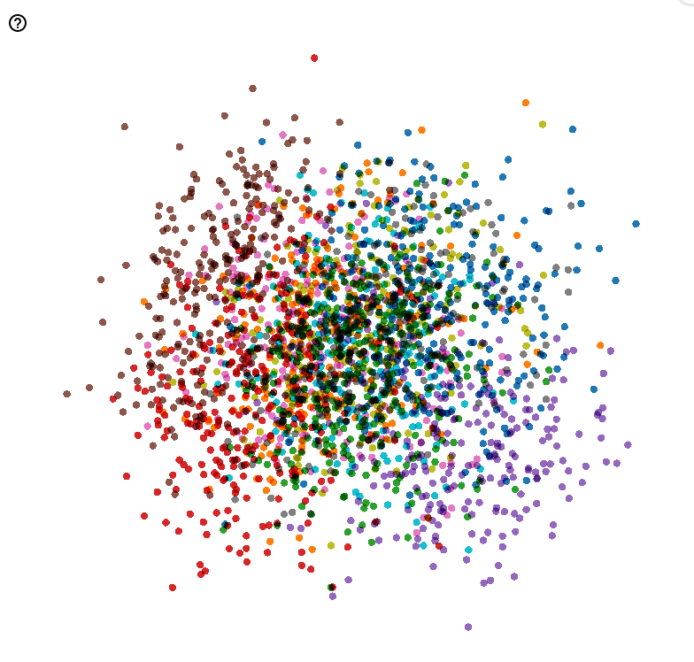

# AE, VAE

pytorch lightning 적극 사용

```python
model = AutoEncoder(
    img_dim=img_dim, # 정수배
    variational=False, # VAE, AE 선택가능
    enc_type='resnet9_8', # 백본 타입; resnet18, resnet50, resnet9(resnet18 보다 더 작은 custom)
)
```

## 내가 자주하는 실수

- latent dim, model size를 너무 작게 잡고 실험 => version_1 같은 형태가 발생함.

## 결과



